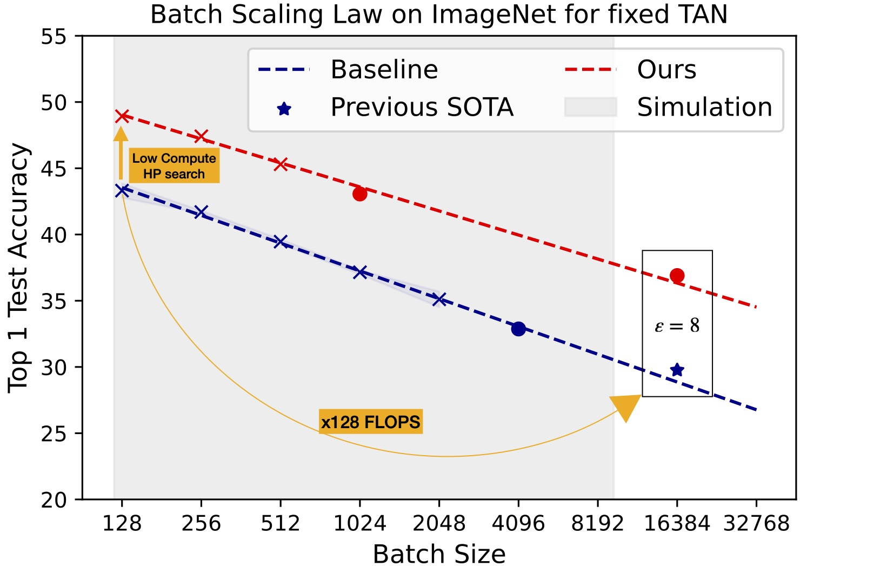

# TAN Without a Burn: Scaling Laws of DP-SGD

This repository hosts python code for the paper: [TAN Without a Burn: Scaling Laws of DP-SGD](https://arxiv.org/abs/2210.03403).

<p align="center">
  
</p>

## Installation

Via pip and anaconda

```
conda create -n "tan" python=3.9 
conda activate tan
pip install -r ./requirements.txt
```

## Quick Start

### WideResNet-16-4 on CIFAR-10

To get fixed $\delta$ and $\epsilon$ for the project, we only use TAN during hyper-parameter searching period. The final version here fixed $\epsilon=3.0$ and $\delta=10^{-5}$.

```bash
python cifar10.py --batch_size 4096 --ref_nb_steps 2500 --transform 16 --lr 2 --cos --max_physical_batch_size 256
```

We get the highest test accuracy in this hyper-parameter.

```
INFO - 04/17/24 05:26:02 - 1 day, 11:48:48 - __log:{"final_train_acc_ema": 0.6871647938588534, "final_test_acc_ema": 0.6726369492072272, "final_epsilon": 2.888699808736547, "avergage_grad_sample_gradients_norms": 413.57132804573007}
```

## License
This code is released under BSD-3-Clause, as found in the [LICENSE](https://github.com/facebookresearch/tan/LICENSE) file.
